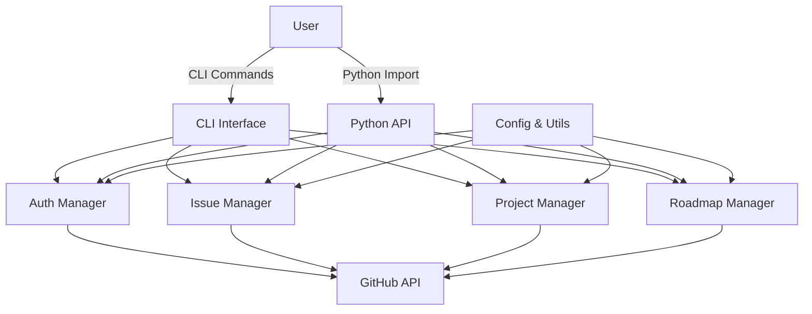
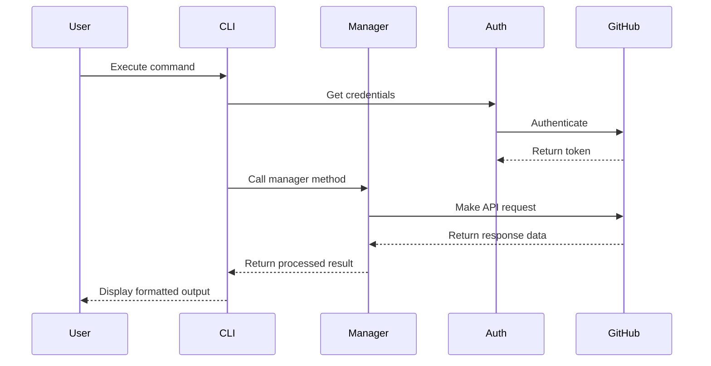
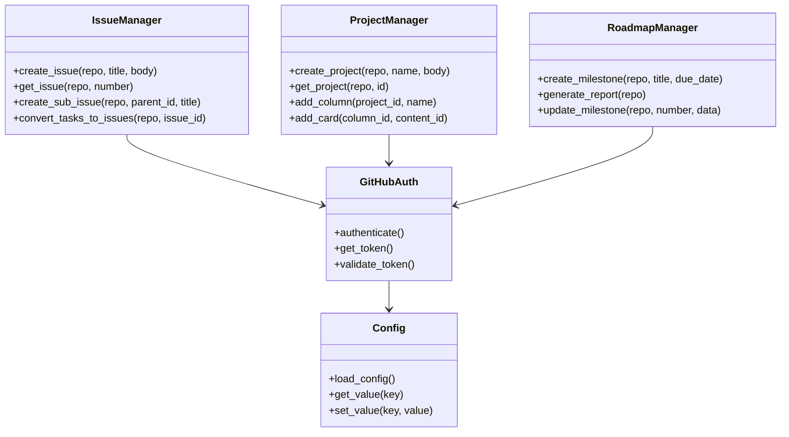

# GitCompass: GitHub Project Management Tool

<div align="center">


[](https://github.com/PimpMyNines/github-project-management/actions/workflows/tests.yml)
[](https://www.python.org/downloads/)
[](https://opensource.org/licenses/MIT)

</div>

A powerful Python-based tool for managing GitHub projects, issues, sub-issues, and roadmaps.

## 📋 Overview

GitCompass provides a comprehensive solution for managing GitHub projects through both a command-line interface and a Python API. It streamlines workflows for developers, project managers, and team leads.

## 🏗️ Architecture

```
┌─────────────────┐     ┌───────────────────┐     ┌─────────────────┐
│  CLI Interface  │────▶│    Core Modules   │────▶│  GitHub API     │
└─────────────────┘     │                   │     └─────────────────┘
                        │ ┌───────────────┐ │     
┌─────────────────┐     │ │ Auth Manager  │ │     ┌─────────────────┐
│  Python API     │────▶│ ├───────────────┤ │────▶│  GitHub GraphQL │
└─────────────────┘     │ │ Issue Manager │ │     └─────────────────┘
                        │ ├───────────────┤ │     
                        │ │ Project Mgr   │ │     
                        │ ├───────────────┤ │     
                        │ │ Roadmap Mgr   │ │     
                        │ └───────────────┘ │     
                        │                   │     
                        │ ┌───────────────┐ │     
                        │ │Config & Utils │ │     
                        │ └───────────────┘ │     
                        └───────────────────┘     
```

### Component Relationships



### Data Flow



### Class Diagram



## 🌟 Features

- **🔑 Authentication**: Support for both personal access tokens and GitHub Apps
- **📊 Issue Management**: Create issues, sub-issues, and convert task lists to proper sub-issues
- **📋 Project Management**: Create and configure projects, manage columns and cards
- **🗓️ Roadmap Planning**: Create milestones and generate detailed roadmap reports
- **🔄 Cross-Repository Operations**: Work across multiple repositories
- **💼 Flexible Configuration**: Environment variables, config files, and CLI options

## 🚀 Installation

### From PyPI (Coming Soon)

```bash
pip install gitcompass
```

### Development Installation

```bash
# Clone the repository
git clone https://github.com/PimpMyNines/github-project-management.git
cd github-project-management

# Create and activate virtual environment
python -m venv venv
source venv/bin/activate  # On Windows: venv\Scripts\activate

# Option 1: Install with pip
pip install -e .

# Option 2: Install with make
make install
```

### Docker

```bash
# Build the Docker image
docker build -t gitcompass .

# Run with Docker
docker run -it --rm -e GITHUB_TOKEN=your-token gitcompass --help
```

## 📋 Quick Start

### Authentication

Set up authentication using one of these methods:

#### Method 1: Environment Variable (Recommended for CLI)

```bash
export GITHUB_TOKEN=your-github-token
```

#### Method 2: Config File (Persistent configuration)

Create a config file at `~/.gitcompass/config.yaml`:

```yaml
auth:
  token: "your-github-token"
  # Optional: Set default repository to avoid specifying --repo for every command
  default_repo: "owner/repo"
  # Optional: GitHub Enterprise settings
  api_url: "https://github.example.com/api/v3"
```

#### Method 3: GitHub App Authentication (For larger deployments)

```yaml
auth:
  app_id: "12345"
  private_key_path: "/path/to/private-key.pem"
  installation_id: "67890"  # Optional, if managing a specific installation
```

### Command-Line Interface

GitCompass offers a comprehensive CLI for all GitHub project management tasks:

#### Issue Management

```bash
# List issues
gitcompass issues list --repo owner/repo --state open --label bug

# Create an issue
gitcompass issues create --repo owner/repo --title "New feature" \
  --body "Feature description" --labels "enhancement,priority:high"

# Create a sub-issue
gitcompass issues create --repo owner/repo --title "Sub-task" \
  --parent 123 --assignee "username"

# Convert all task list items in an issue to proper sub-issues
gitcompass issues convert-tasks --repo owner/repo --issue 123 \
  --add-labels "task" --assign-to "username"

# Create a linked issue in another repository
gitcompass issues create --repo owner/other-repo --title "Cross-repo task" \
  --linked-to "owner/repo#123"
```

#### Project Management

```bash
# Create a new project
gitcompass projects create --name "Q2 Development" --repo owner/repo \
  --template "Basic Kanban"

# List projects
gitcompass projects list --repo owner/repo

# Add an issue to a project column
gitcompass projects add-item --repo owner/repo --project-id 1234 \
  --column "In Progress" --issue 456

# Move a card to another column
gitcompass projects move-card --card-id 789 --column "Done"

# Generate project status report
gitcompass projects report --repo owner/repo --project-id 1234 \
  --format markdown --output project-status.md
```

#### Roadmap Planning

```bash
# Create a milestone
gitcompass roadmap create --repo owner/repo --title "v1.0" \
  --due-date 2023-12-31 --description "First stable release"

# Link issues to milestone
gitcompass roadmap add-issues --repo owner/repo --milestone "v1.0" \
  --issues 123,456,789

# Generate detailed roadmap report with progress
gitcompass roadmap report --repo owner/repo --upcoming 3 \
  --format html --output roadmap.html

# Update milestone status
gitcompass roadmap update --repo owner/repo --milestone "v1.0" \
  --state closed --completion-date 2023-12-15
```

### Python API

GitCompass provides a clean Python API for programmatic access:

#### Basic Usage

```python
from gitcompass.auth.github_auth import GitHubAuth
from gitcompass.issues.issue_manager import IssueManager
from gitcompass.utils.config import Config

# Initialize components
config = Config()
auth = GitHubAuth(config)
issue_manager = IssueManager(auth)

# Create an issue
issue = issue_manager.create_issue(
    repo="owner/repo",
    title="API Issue",
    body="Created via Python API",
    labels=["enhancement"]
)

print(f"Created issue #{issue['number']}")
```

#### Advanced API Usage

```python
from gitcompass.auth.github_auth import GitHubAuth
from gitcompass.issues.issue_manager import IssueManager
from gitcompass.projects.project_manager import ProjectManager
from gitcompass.roadmap.roadmap_manager import RoadmapManager
from gitcompass.utils.config import Config

# Initialize with custom config file location
config = Config(config_path="~/my-projects/gitcompass-config.yaml")
auth = GitHubAuth(config)

# Create managers for different operations
issue_mgr = IssueManager(auth)
project_mgr = ProjectManager(auth)
roadmap_mgr = RoadmapManager(auth)

# Create a milestone
milestone = roadmap_mgr.create_milestone(
    repo="owner/repo",
    title="Q1 Release",
    due_date="2023-03-31",
    description="First quarter objectives"
)

# Create multiple issues and add to milestone
issues = []
for i, task in enumerate(["Research", "Design", "Implement", "Test", "Deploy"]):
    issue = issue_mgr.create_issue(
        repo="owner/repo",
        title=f"{task} new feature",
        body=f"Task {i+1}: {task} the new feature",
        milestone=milestone["number"],
        labels=["q1-release"]
    )
    issues.append(issue)
    
# Create a project and add issues to it
project = project_mgr.create_project(
    repo="owner/repo",
    name="Feature Development",
    body="Track progress of the new feature"
)

# Add columns to project
columns = {}
for name in ["To Do", "In Progress", "Review", "Done"]:
    columns[name] = project_mgr.add_column(project["id"], name)

# Add all issues to the "To Do" column
for issue in issues:
    project_mgr.add_card(
        column_id=columns["To Do"]["id"],
        content_id=issue["id"],
        content_type="Issue"
    )

# Generate a roadmap report
report = roadmap_mgr.generate_report(
    repo="owner/repo",
    format="markdown",
    include_closed=False
)

with open("roadmap_report.md", "w") as f:
    f.write(report)
```

## 📚 Documentation

For detailed documentation, see the [docs](./docs) directory:

- [Command-Line Reference](./docs/README.md)
- [API Documentation](./docs/API_REFERENCE.md)
- [Configuration Guide](./docs/CONFIGURATION.md)

## 💻 Examples

Check out the [examples](./examples) directory for practical usage examples:

- [Create Issue Hierarchy](./examples/create_issue_hierarchy.py) - Create parent issues with sub-tasks
- [Advanced Project Setup](./examples/advanced_project_setup.py) - Set up a complete project with milestones

## 🧪 Development

```bash
# Install development dependencies
make develop

# Run tests
make test

# Run linting
make lint

# Format code
make format
```

## 🚀 Deployment

### Production Deployment Considerations

When deploying GitCompass in a production environment, consider the following best practices:

#### Authentication Security

- Use environment variables for tokens in production systems
- For services/automation, create dedicated GitHub Apps with minimal permissions
- Rotate tokens and keys regularly
- Use GitHub Enterprise security features when available

#### Scaling Considerations

- For heavy usage, implement rate limiting and pagination handling
- Consider running as a service for shared access across teams
- For large enterprises, deploy as an internal service with centralized authentication

#### Monitoring and Logging

```yaml
# Example configuration with logging
logging:
  level: INFO  # DEBUG, INFO, WARNING, ERROR, CRITICAL
  file: "~/.gitcompass/logs/gitcompass.log"
  format: "%(asctime)s - %(name)s - %(levelname)s - %(message)s"
  max_size: 10485760  # 10MB
  backup_count: 5
```

### Docker Deployment

For containerized environments:

```bash
# Build with custom configuration
docker build -t gitcompass:prod .

# Run with mounted config
docker run -it --rm \
  -v ~/.gitcompass:/root/.gitcompass \
  -e GITHUB_TOKEN=$GITHUB_TOKEN \
  gitcompass:prod issues list --repo owner/repo
```

### CI/CD Integration

GitCompass can be integrated into CI/CD pipelines for automation:

```yaml
# Example GitHub Action using GitCompass
name: Weekly Roadmap Report
on:
  schedule:
    - cron: '0 9 * * MON'  # Every Monday at 9 AM
jobs:
  generate-report:
    runs-on: ubuntu-latest
    steps:
      - uses: actions/checkout@v4
      - name: Set up Python
        uses: actions/setup-python@v5
        with:
          python-version: '3.10'
      - name: Install GitCompass
        run: pip install gitcompass
      - name: Generate roadmap report
        run: |
          gitcompass roadmap report \
            --repo ${{ github.repository }} \
            --format markdown \
            --output roadmap.md
        env:
          GITHUB_TOKEN: ${{ secrets.GITHUB_TOKEN }}
      - name: Commit report
        uses: EndBug/add-and-commit@v9
        with:
          add: 'roadmap.md'
          message: 'Update weekly roadmap report'
```

## 🤝 Contributing

Contributions are welcome! See [CONTRIBUTORS.md](./CONTRIBUTORS.md) for details on how to get started.

### Development Environment

```bash
# Clone the repository
git clone https://github.com/PimpMyNines/github-project-management.git
cd github-project-management

# Set up development environment
make develop

# Run tests
make test

# Create a feature branch
git checkout -b feature/your-feature-name

# Make your changes, add tests, and ensure tests pass
make test

# Submit a pull request
```

## 📜 License

This project is licensed under the MIT License - see the [LICENSE](./LICENSE) file for details.
